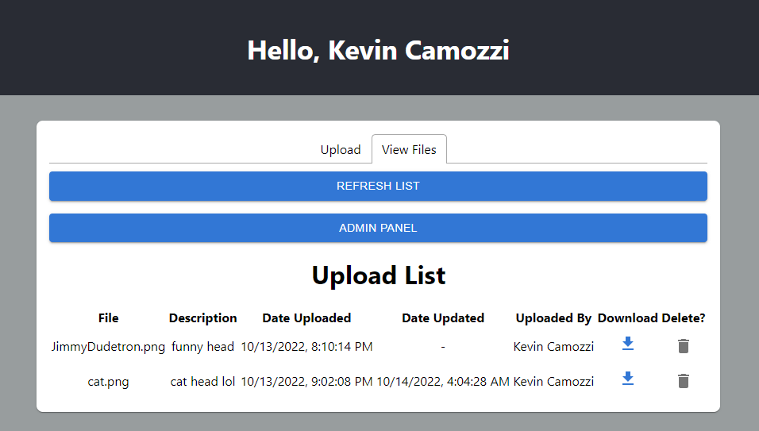

Kevin Camozzi

CMPE 281

10/13/2022

# **Project 1**

**Registration/Login**

Simple sign on and account creations supported by AWS Cognito and AWS Amplify. Users are tracked across the application and required to be authenticated to use the upload and listing functionality.

**Upload**

Users can upload files \< 20Mb to the S3 bucket. File description is available via a text input field.

**Download / Delete**

Files can be downloaded via a Download icon in the relevant row. Deletion is also relative to the row containing the deletion icon.

**Edit/Updates**

Uploading the same file again will result in the file being updated in the bucket and the most recent update time is logged in the upload list. File versioning is enabled on the S3 bucket.

**Admin Panel**

Before admin panel has been accessed.

Before admin panel has been accessed.

The Admin Panel is visible only to specific administrator users. If viewing the upload list from a normal user, the admin panel option is not available. Admins can remove any users files at will.

**SNS/Cloudwatch**

SNS and Cloudwatch have been enabled on the S3 bucket to perform checks on the capacity of the applications bucket. This alarm will sound when more than 1000 objects are inserted into the bucket. The notification is sent to a verified admin email address.

**DR Measures**

Disaster Recovery measures include Multi AZ scaling and a standby RDS instance for the MySQL database. This allows for the records of all uploads to be recovered in the case of a database outage. This also allows for multiple instances to be utilized if the load is too heavy on the main EC2 instance.
